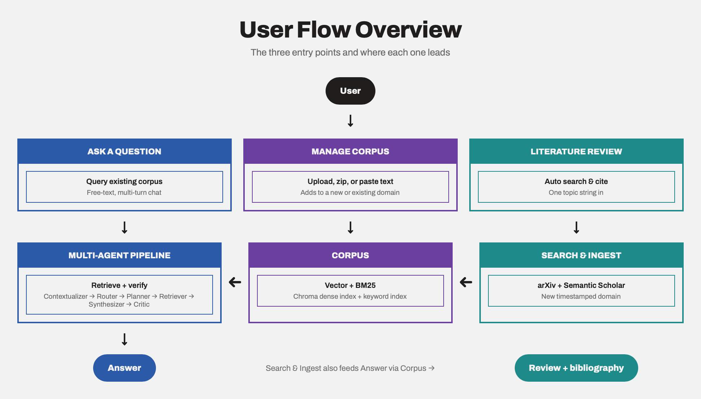
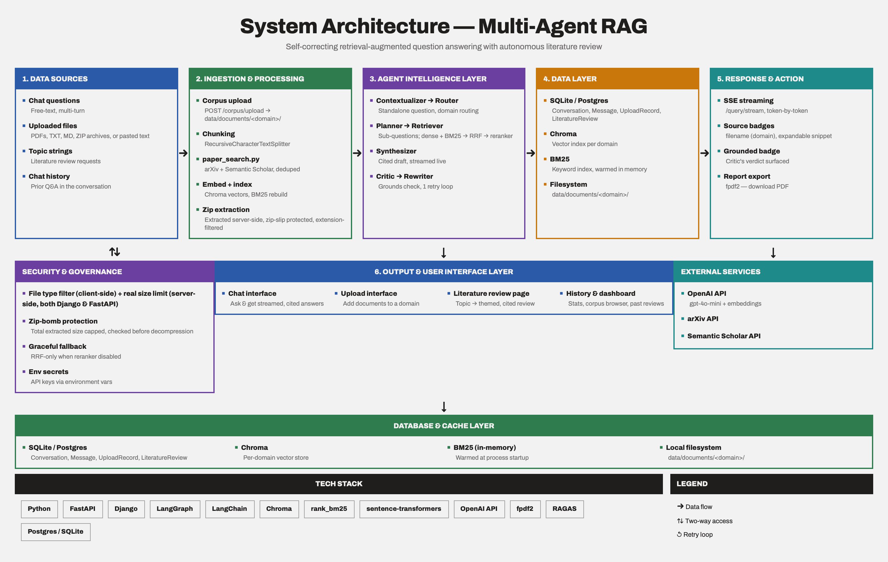
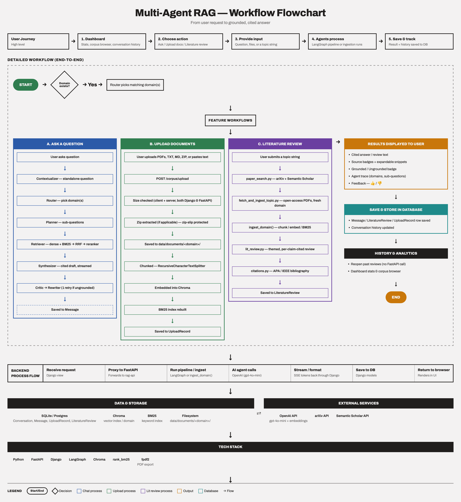
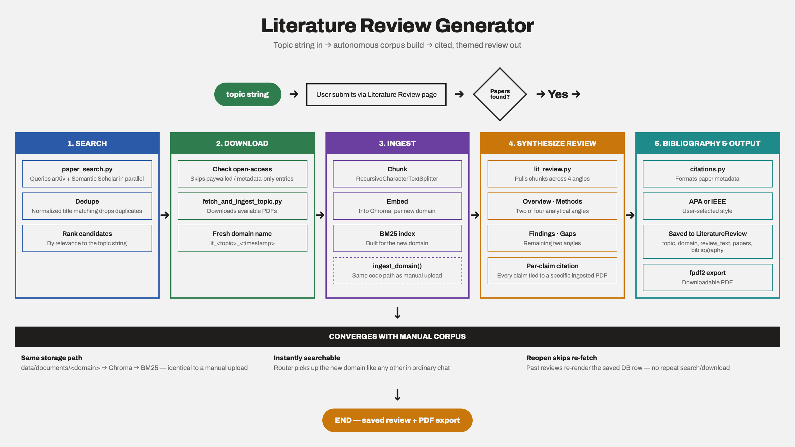

# Multi-Agent RAG — Grounded Research Assistant

A retrieval-augmented generation system built with **LangGraph** that routes
queries across multiple domain-specific retrievers, verifies every answer
against retrieved evidence with a critic agent, and only shows an answer
once it's actually backed by the source material — or honestly says it
doesn't know. It also includes a **Literature Review Generator** that
autonomously searches arXiv and Semantic Scholar for a given topic,
ingests the open-access papers it finds, and writes a structured, cited
review with a formatted bibliography.

There are three ways into the system, and the first two share one corpus:



Unlike a single RAG chain, question-answering here is a genuine 7-agent
pipeline:



## Why this exists

Most "AI research assistant" demos are a chatbot bolted onto a PDF — no way
to know if the answer is actually true or just plausible-sounding. This
project makes the AI justify its own answer before showing it to you: the
critic agent checks the draft against the retrieved evidence, and if it
isn't well-supported, a rewriter reformulates and retries instead of
returning an unverified answer. The same verification-first philosophy
carries into the Literature Review feature: every claim in a generated
review is tied back to a specific ingested source (`[filename.pdf]`), not
written from the model's general knowledge.

## Workflow: how a chat request flows through the system

The diagram above shows what happens *inside* the agent pipeline. This one
shows the full round trip — every layer a question passes through, from
the browser to the database and back:



Two servers are involved on purpose: FastAPI owns the agent pipeline, the
literature-search pipeline, and all model calls, while Django owns the
dashboard, conversation history, and persistence. Django never talks to
the agents or Chroma directly — it always proxies through FastAPI, which
is what keeps the two services cleanly separated.

## Literature Review Generator

Given a topic string, the system builds its own corpus and writes a review
autonomously — no manual paper-hunting required:



The generated review, its paper list, and bibliography are saved to the
database (`LiteratureReview` model), so past reviews can be reopened
instantly from the Dashboard without re-running the search. Reviews are
also downloadable as a formatted PDF.

Because the fetched papers land in the same `data/documents/<domain>/`
structure as anything manually uploaded, they're immediately searchable
from ordinary chat too — Literature Review isn't a separate silo.

## Primary interface: Django dashboard

The main way to use this project is the **Django web dashboard**
(`django_dashboard/`) — a full UI on top of the FastAPI backend below.

- **Chat** — ask questions, see answers stream in live, with a
  GROUNDED / UNGROUNDED badge, response time, a copy button, 👍/👎
  feedback, and an expandable **Agent trace** (domains routed, planner's
  sub-questions, source PDFs — each one clickable to preview an inline
  snippet or open/download the full document)
- **Explain Simply** — a toggle that rewrites the same grounded, cited
  answer in plain, beginner-friendly language
- **Literature Review** — enter a topic, choose APA/IEEE, get a themed,
  cited review plus bibliography; download as PDF; past reviews are
  saved and reopenable
- **Corpus browser** — see every ingested document, grouped by domain
  (including domains Literature Review created)
- **Upload documents** — add PDFs, TXT, or MD files (individually or
  bundled in a `.zip`, which gets extracted automatically), or paste text
  directly instead of uploading a file — into a new or existing domain;
  everything is embedded and queryable immediately, no restart needed.
  Per-file size limit is configurable via `MAX_UPLOAD_FILE_SIZE_MB`
  (defaults to 2048MB/2GB locally; set lower on memory-constrained
  deployments)
- **History** — every past conversation, searchable, renameable,
  deletable, and exportable as Markdown
- **Trending topics / popular papers** — which domains and source papers
  get asked about most, built from real usage
- **Dashboard stats** — a live grounded rate calculated across every real
  conversation, plus corpus size, a 14-day conversation trend, and a
  literature-review count with a "recent reviews" list
- Mobile-responsive, with an animated startup screen

A minimal Gradio UI (`ui/app_gradio.py`) also exists for quick local testing
directly against the FastAPI backend, without the dashboard.

## Stack

- **LangGraph** — agent orchestration / state graph
- **LangChain** — retrievers, prompt templates, output parsers
- **Chroma** — vector store
- **rank_bm25** — keyword/sparse retrieval, fused with dense search via RRF
- **FastAPI** — API layer, streaming responses, literature search + PDF export
- **Django** — primary web dashboard
- **Gradio** — minimal secondary UI for quick testing
- **fpdf2** — literature review PDF export
- **RAGAS** — offline faithfulness/context-precision evaluation
- **Docker** — packaging

## Project layout

```
app/
  agents/
    contextualizer.py  # resolves follow-up questions using chat history
    router.py           # classifies query, picks which domain retriever(s) to call
    planner.py          # decomposes multi-part questions into sub-questions
    retriever.py         # builds domain-scoped hybrid retriever agents
    reranker.py           # cross-encoder reranking of hybrid search results
    hybrid_search.py       # BM25 + dense search fused via RRF
    synthesizer.py          # produces the final cited chat answer
    critic.py                 # grounds-checks the draft answer against retrieved chunks
    rewriter.py                # reformulates the question on a failed grounding check
    lit_review.py                # synthesizes a themed, per-claim-cited literature review
    graph.py                      # wires the chat agents together into a LangGraph StateGraph
  ingestion/
    fetch_arxiv.py       # bulk-downloads papers from arXiv by search query (manual/scripted)
    paper_search.py        # searches arXiv + Semantic Scholar by topic (used by Literature Review)
    fetch_and_ingest_topic.py  # orchestrates search → download → ingest for a lit review topic
    ingest.py                    # loads, chunks, and embeds documents into Chroma
  vectorstore/
    store.py               # Chroma collection management, one collection per domain
  citations.py              # APA/IEEE citation + bibliography formatting
  main.py                    # FastAPI app: /query, /query/stream, /corpus/upload,
                              #   /literature-review
  config.py                    # settings (model names, chunk sizes, domains)
ui/
  app_gradio.py                 # minimal chat UI hitting the FastAPI backend directly
django_dashboard/
  chat/                          # the main dashboard app
    models.py                     # Conversation, Message, UploadRecord, LiteratureReview
    views.py                       # chat streaming, upload, literature review, dashboard stats
    templates/chat/                 # index, dashboard, history, corpus, upload, lit_review
  dashboard/                      # Django project settings
data/
  documents/                       # source docs, organized by domain subfolder
                                    # (both manually-uploaded and literature-review-fetched)
```

## Setup

### 1. FastAPI backend

```bash
python -m venv venv
source venv/bin/activate
pip install -r requirements.txt
cp .env.example .env   # fill in your OpenAI API key
```

Add your corpus into `data/documents/<domain_name>/`, e.g.:

```
data/documents/
  ai_papers/
  multi_agent/
  general/
```

Each subfolder becomes its own retriever domain. There are three ways to
populate a domain:

1. **Manually** — drop PDF/TXT/MD files (or a `.zip` of them) straight
   into a `data/documents/<domain>/` folder, or use the dashboard's
   Upload page (also supports pasting raw text directly).
2. **Bulk arXiv script** — for scripted/offline corpus building:
   ```bash
   python -m app.ingestion.fetch_arxiv --query "retrieval augmented generation" --domain ai_papers --max 100
   ```
3. **Literature Review page** — the fully automated path: give it a
   topic, it searches arXiv *and* Semantic Scholar, downloads what's
   open-access, and ingests it into a new domain on its own.

After manually dropping files (options 1 without the dashboard, or 2),
ingest whatever's in `data/documents/`:

```bash
python -m app.ingestion.ingest
```

Run the API:

```bash
uvicorn app.main:app --reload
```

### 2. Django dashboard

In a second terminal:

```bash
cd django_dashboard
python -m venv venv
source venv/bin/activate
pip install -r requirements.txt
cp .env.example .env   # set FASTAPI_BASE_URL to point at the API above
python manage.py migrate
python manage.py runserver 8001
```

Open `http://127.0.0.1:8001` — the FastAPI backend must already be running
on port 8000 for the dashboard to work, since it proxies every query there.

### 3. (Optional) Gradio quick-test UI

```bash
python ui/app_gradio.py
```

## Docker

```bash
docker compose up --build
```

## Deployment (Render)

`render.yaml` defines two web services (`rag-api`, Docker; `rag-dashboard`,
Python/gunicorn) and a free Postgres database. A few env vars matter for
resource-constrained instances:

- `ENABLE_RERANKER` — off by default; the cross-encoder reranker needs
  `sentence-transformers`/`torch`, which alone can exceed a small
  instance's RAM. Falls back to RRF-only ranking when disabled.
- `MAX_UPLOAD_FILE_SIZE_MB` — per-file upload cap. Set lower (e.g. `150`)
  on a memory-constrained instance; both Django and FastAPI must agree on
  this value, since Django rejects oversized files itself before ever
  forwarding to FastAPI.

## Hybrid retrieval + cross-encoder reranking

Hybrid search (dense + BM25) pulls candidates per domain via Reciprocal
Rank Fusion, then — when `ENABLE_RERANKER=true` — a cross-encoder
(`cross-encoder/ms-marco-MiniLM-L-6-v2` by default) re-scores each (query,
passage) pair jointly and keeps only the top results. RRF's fused rank is
a cheap positional heuristic; the cross-encoder actually reads the query
against each passage together, which is what production RAG systems use
to fix cases where a semantically-similar-but-irrelevant chunk outranks
the one that actually answers the question. When the reranker is disabled
(e.g. to fit a memory-constrained deploy), the pipeline gracefully falls
back to the RRF-fused ranking alone.

The reranker model (~90MB) downloads once from Hugging Face on first run
and is cached under `~/.cache/huggingface`; the server loads it at startup
so the first query isn't stuck waiting on it.

## Streaming

`POST /query/stream` returns Server-Sent Events instead of a single JSON
blob — the answer streams in token by token as the synthesizer generates
it, instead of waiting for the whole pipeline to finish. If the critic
rejects the draft and the rewriter retries, a `restart` event tells the
client to clear the partial answer before the second attempt streams in.
The Django dashboard uses this endpoint by default. Literature review
generation is a single blocking `/literature-review` call instead
(search + downloads + synthesis genuinely takes a few minutes, so there's
no token-level streaming for it).

## Conversation memory

The API keeps a short server-side history per `session_id` (last 6 turns,
in-memory — resets on restart). The Django dashboard tracks this
automatically per conversation; the contextualizer agent uses it to
resolve follow-up questions like "what are its limitations?" without
you having to repeat context.

## Tracing (LangSmith)

Every agent call in this graph is a LangChain runnable, so LangSmith tracing
works with zero code changes — just environment variables:

```
LANGCHAIN_TRACING_V2=true
LANGCHAIN_API_KEY=ls__your_key_here
LANGCHAIN_PROJECT=multi-agent-rag
```

Each query shows up as a full trace: which domain the router picked, what
sub-questions the planner produced, which chunks the hybrid retriever
pulled, the synthesizer's draft, the critic's verdict, and — when it
fires — the rewriter's reformulated query on retry. `GET /health` reports
whether tracing is currently active.

## Notes

- The router + per-domain retrievers is what makes this "multi-agent"
  rather than a single RAG chain.
- The critic agent is the interesting part: it re-checks the draft answer
  against the actual retrieved text and can trigger a re-retrieval loop
  instead of just returning an ungrounded answer. Tested directly: asking
  something entirely outside the corpus produces an honest "the provided
  context does not contain this information" instead of a fabricated
  answer — and that honest refusal is itself correctly marked grounded.
- The Django dashboard's live grounded-rate stat is calculated from real
  usage across every conversation, not a one-time benchmark.
- File uploads accept `.pdf`, `.txt`, `.md`, and `.zip` (extracted
  server-side with zip-slip protection and a total-extracted-size cap).
  Client-side filtering on file type is JS-only (an extension check);
  the enforced size limit is checked on both the Django and FastAPI
  sides.
- There is currently no authentication/login on the dashboard - anyone
  who can reach the deployed URL can use it as-is.
